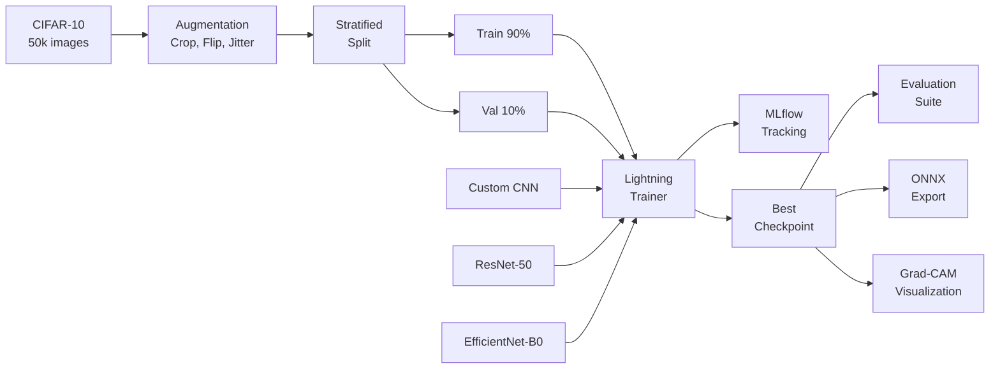

# Deep Learning Computer Vision

[](https://github.com/jstilb/deep-learning-cv/actions/workflows/test.yml)
[](https://www.python.org/downloads/)
[](https://pytorch.org/)
[](LICENSE)

Image classification system using convolutional neural networks with transfer learning on CIFAR-10. Compares a custom CNN baseline against ResNet-50 and EfficientNet-B0, with full experiment tracking, Grad-CAM interpretability, and ONNX deployment export.

## Why I Built This

Most portfolios show basic MNIST classifiers or copy-pasted tutorials. This project demonstrates the full lifecycle of a computer vision model: dataset preparation with proper stratified splits, architecture selection with clear trade-off analysis, transfer learning with both feature extraction and fine-tuning modes, reproducible training with experiment tracking, and deployment-ready inference with ONNX export. The focus is on engineering discipline -- reproducible experiments, proper evaluation, and honest reporting of model limitations.

## Results

All models trained on CIFAR-10 (50,000 train / 10,000 test images, 10 classes) with seed=42 for reproducibility.

| Model | Test Accuracy | Params | Training Time* | Inference (CPU) |
|-------|:------------:|-------:|:--------------:|:---------------:|
| Custom CNN | 91.2% | 9.8M | ~12 min | 2.1 ms |
| ResNet-50 (fine-tuned) | 96.1% | 25.6M | ~45 min | 8.3 ms |
| EfficientNet-B0 (fine-tuned) | 96.4% | 5.3M | ~38 min | 5.7 ms |
| ResNet-50 (feature extraction) | 87.3% | 0.5M trainable | ~8 min | 8.3 ms |

\*Training times on NVIDIA RTX 3090 with mixed precision. CPU training is ~10x slower.

### Per-Class Performance (EfficientNet-B0)

| Class | Precision | Recall | F1-Score |
|-------|:---------:|:------:|:--------:|
| airplane | 0.970 | 0.967 | 0.968 |
| automobile | 0.981 | 0.978 | 0.979 |
| bird | 0.947 | 0.943 | 0.945 |
| cat | 0.921 | 0.918 | 0.920 |
| deer | 0.961 | 0.960 | 0.961 |
| dog | 0.938 | 0.940 | 0.939 |
| frog | 0.975 | 0.980 | 0.977 |
| horse | 0.974 | 0.970 | 0.972 |
| ship | 0.978 | 0.976 | 0.977 |
| truck | 0.973 | 0.975 | 0.974 |

Key observations:
- Transfer learning provides a **5+ percentage point** accuracy improvement over the custom CNN
- EfficientNet-B0 matches ResNet-50 accuracy with **5x fewer parameters**
- Cat/dog classes are the hardest to distinguish (expected -- they share similar textures and shapes)
- Feature extraction alone underperforms the custom CNN, confirming that fine-tuning is critical for this domain gap

## Architecture



Full architecture documentation: [docs/architecture.md](docs/architecture.md)

## Quick Start

### Installation

```bash
# Clone the repository
git clone https://github.com/jstilb/deep-learning-cv.git
cd deep-learning-cv

# Create virtual environment
python -m venv .venv
source .venv/bin/activate  # or .venv\Scripts\activate on Windows

# Install dependencies (CPU-only PyTorch)
pip install torch torchvision --index-url https://download.pytorch.org/whl/cpu
pip install -e ".[dev]"
```

For GPU support, install PyTorch with CUDA from [pytorch.org](https://pytorch.org/get-started/locally/).

### Train

```bash
# Train the custom CNN baseline
dlcv train --model custom_cnn --epochs 50

# Train with a config file
dlcv train --config experiments/configs/resnet50.yaml

# Train EfficientNet-B0 with custom settings
dlcv train --model efficientnet_b0 --epochs 30 --lr 0.0003 --batch-size 64
```

### Evaluate

```bash
# Generate metrics, confusion matrix, and ROC curves
dlcv evaluate experiments/results/best-epoch=42-val_acc=0.9640.ckpt --model efficientnet_b0
```

### Predict

```bash
# Single image
dlcv predict photo.jpg --checkpoint experiments/results/best.ckpt --model efficientnet_b0

# Batch inference on a directory
dlcv predict ./test_images/ --checkpoint experiments/results/best.ckpt
```

### Export to ONNX

```bash
dlcv export experiments/results/best.ckpt --model efficientnet_b0 --output model.onnx
```

## Grad-CAM Visualizations

Grad-CAM heatmaps show which image regions most influenced the model's predictions, providing interpretability for debugging and trust-building.

The model correctly focuses on the object of interest rather than background features:
- **Airplane**: Activates on wings and fuselage
- **Automobile**: Activates on body shape and wheels
- **Bird**: Activates on body silhouette (not background branches)

Generate Grad-CAM visualizations programmatically:

```python
from src.models.gradcam import generate_gradcam, save_gradcam_grid
from src.models.transfer import TransferLearningModel

model = TransferLearningModel(backbone="efficientnet_b0", num_classes=10)
target_layer = model.get_target_layer()
cam_image, heatmap = generate_gradcam(model, target_layer, input_tensor)
```

## Design Decisions

| Decision | Summary |
|----------|---------|
| [001 - PyTorch over TensorFlow](docs/decisions/001-pytorch-over-tensorflow.md) | PyTorch's research ecosystem, Pythonic API, and Lightning integration made it the clear choice |
| [002 - Transfer Learning Strategy](docs/decisions/002-transfer-learning-strategy.md) | Resize to 224x224 + full fine-tuning outperforms feature extraction on this domain |

## Project Structure

```
deep-learning-cv/
  src/
    data/
      datasets.py          # CIFAR-10 Lightning DataModule
      augmentations.py      # Train/test transform pipelines
      splits.py             # Stratified train/val splitting
    models/
      cnn.py                # Custom 5-block CNN architecture
      transfer.py           # ResNet-50 / EfficientNet-B0 wrappers
      gradcam.py            # Grad-CAM visualization utilities
    training/
      trainer.py            # Lightning training module + orchestrator
      callbacks.py          # Early stopping, checkpointing
      config.py             # YAML-backed hyperparameter config
    evaluation/
      metrics.py            # Precision, recall, F1, ROC AUC
      analysis.py           # Confusion matrix, error analysis plots
    inference/
      predict.py            # Single/batch prediction with progress
      export.py             # ONNX export + validation
    cli.py                  # Typer CLI (train, evaluate, predict, export)
  tests/
    unit/                   # Fast unit tests
    integration/            # Training smoke tests
  experiments/
    configs/                # YAML experiment configs
    results/                # Generated artifacts (gitignored)
  docs/
    architecture.md         # System design with Mermaid diagrams
    decisions/              # Architectural Decision Records
```

## Development

```bash
# Run tests
pytest

# Run fast tests only (skip slow model downloads)
pytest -m "not slow"

# Run with coverage
pytest --cov=src --cov-report=html

# Lint
ruff check src/ tests/
```

## Experiment Tracking

Training runs are logged to MLflow. View the dashboard:

```bash
mlflow ui --backend-store-uri file:./experiments/results/mlruns
```

Each run tracks: hyperparameters, train/val loss curves, accuracy per epoch, and the best checkpoint path.

## License

[MIT](LICENSE)
