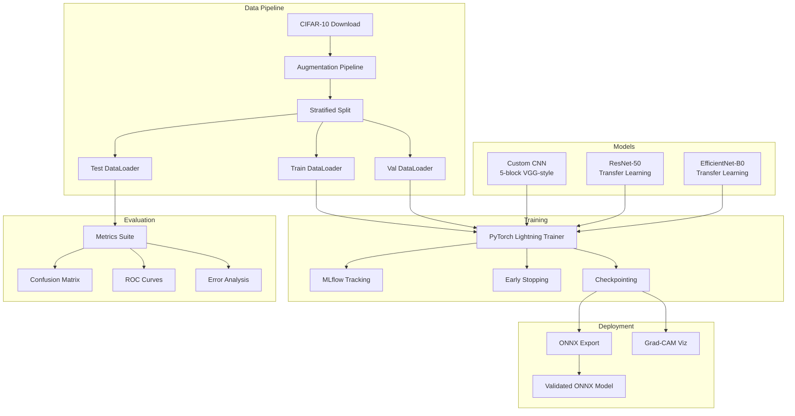
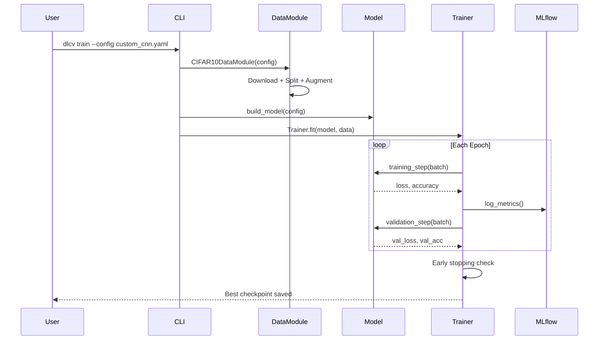

# Architecture

## System Overview

This project implements an image classification pipeline with three model architectures, a unified training framework, comprehensive evaluation, and deployment-ready inference.



## Data Flow



## Model Architectures

### Custom CNN

A VGG-inspired architecture with 5 convolutional blocks, progressive channel widening (64 -> 512), BatchNorm after every convolution, and global average pooling before the classifier head.

```
Input (3x32x32)
  -> Conv(64) + BN + ReLU + MaxPool    -> 64x16x16
  -> Conv(128) + BN + ReLU + MaxPool   -> 128x8x8
  -> Conv(256)x2 + BN + ReLU + MaxPool -> 256x4x4
  -> Conv(512)x2 + BN + ReLU + MaxPool -> 512x2x2
  -> Conv(512)x2 + BN + ReLU           -> 512x2x2
  -> AdaptiveAvgPool(1x1)              -> 512
  -> FC(256) + ReLU + FC(10)           -> 10
```

### Transfer Learning Models

Both ResNet-50 and EfficientNet-B0 use ImageNet-pretrained backbones with a replaced classifier head. Two training modes are supported:

- **Feature Extraction**: Backbone frozen, only classifier trains (fast, lower accuracy)
- **Fine-Tuning**: Entire model trains with lower backbone LR (slower, higher accuracy)

## Key Design Decisions

See the [decisions](decisions/) directory for detailed ADRs:

- [001 - PyTorch over TensorFlow](decisions/001-pytorch-over-tensorflow.md)
- [002 - Transfer Learning Strategy](decisions/002-transfer-learning-strategy.md)
